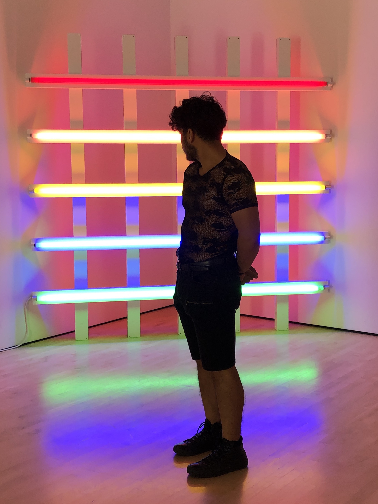

<h1 style="font-family: Garamond, Baskerville; font-size:17pt; font-style:italic"> <b> Jose Aveldanes, Sociology PhD student at UC Berkeley </b> </h1>

<h2 style="font-family: Garamond, Baskerville; font-size:15pt; font-style:normal"> About Me </h2>

 <ol style="font-family: Garamond, Baskerville; font-size:11pt; font-style:normal" >  
 <li> I'm a third-year sociology PhD student in the Sociology Department at UC Berkeley. I am broadly interested in contemporary American families. I focus on family change and study topics on the family ranging from marriage and social boundaries to intergenerational process (e.g., the transmission of advantage or disadvantage across generations. I’ve mainly worked with quantitative data but also have experience working with qualitative data. I have extensive training in R and State, some training in Python, and some training with NVivo. </li>

<li> 
<b> Hometown: Atlanta, GA </b>
</li> 
 
 <li> 
 Pets?: Not yet, waiting to finish my career first! 
 </li> 

 
 <li> 
Hobbies: Hiking, working out, reading, consuming art, practicing French and German! 

 </li> 
</ol> 

